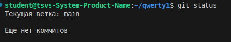
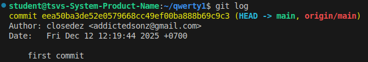
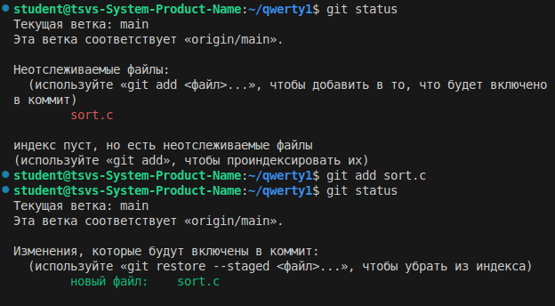
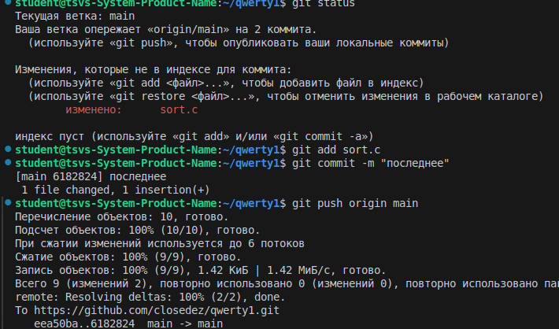
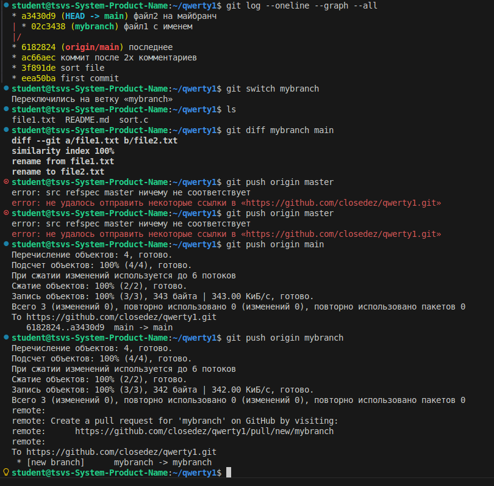

Часть 1 на оценку 3

1

2

3-6

7-14

15-17

Часть 2

1-11

11-17

На оценку 4

1-7

8-10

11

Сначала мы внесли правки в файл sort.c. Изначально они оказались в состоянии unstaged, поэтому команда git diff отображала все изменения, а git diff --staged не показывал ничего. Затем мы добавили sort.c в staged, после чего выводы git diff и git diff --staged поменялись местами. Позже мы внесли в sort.c дополнительные изменения, и теперь git diff --staged показывает правки, уже добавленные в staged, а git diff — изменения, которые остались в unstaged.

12-15

16

17-18

19

20-21

22

Ветки и ff-merge

